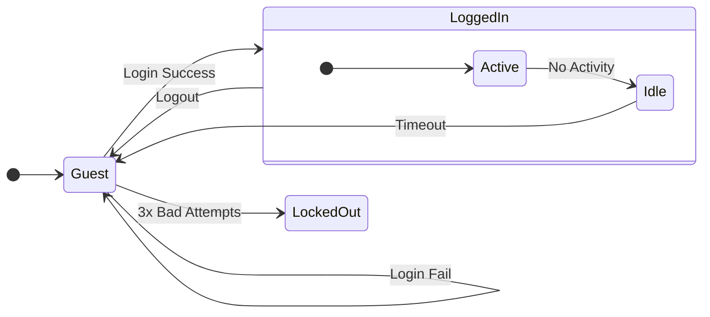
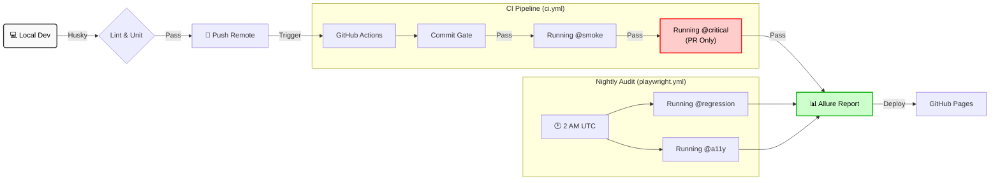

# 🛠️ Technical Design & Engineering Specifications

This document provides a deep-dive into the architectural patterns, ISTQB methodologies, and engineering logic implemented in the **QA-Automation-Suites** framework.

---

## 🏗️ Architecture & The Test Pyramid
To prevent the "Ice Cream Cone" anti-pattern, this suite is weighted toward fast, reliable unit and integration tests. This ensures maximum ROI, rapid execution, and high stability.

```text
                  / \
                 /   \
                /  E2E  \             👉 Playwright (46 Tests)
               /---------\               User Journeys & A11y
              /           \
             / Integration \          👉 Vitest + Fetch (84 Tests)
            /---------------\            API & Business Rules
           /                 \
          /       Unit        \       👉 Vitest (189 Tests)
         /---------------------\         Isolated Maths & Logic
```

* **E2E (~46 Tests):** High-fidelity user simulation covering smoke, critical, regression, and accessibility scenarios.
* **Integration (84 Tests):** API contract validation via Equivalence Partitioning (21), schema integrity (17), loan Decision Table + BVA (43), and heartbeat monitoring (3).
* **Unit (189 Tests):** Sub-millisecond validation of financial utilities and isolated business logic.

---

## 🧪 Loan Approval Decision Table Testing

> **ISTQB Techniques**: Decision Table Testing + 3-Value Boundary Value Analysis
> **System Under Test**: ParaBank Loan Request API
> **Risk Level**: Critical (Financial transaction logic)

### 1. Executive Summary
This document details the test design for ParaBank's loan approval functionality using **Decision Table Testing** combined with **3-Value Boundary Value Analysis (BVA)**. The loan approval process is critical to any banking system - incorrect approvals risk financial loss; incorrect denials damage customer relationships.

**Coverage achieved**: 34 test cases providing complete combinatorial coverage of business rules plus 5-point boundary testing (-2, -1, 0, +1, +2) at every decision point.

### 2. Decision Table Oracle
The decision table below represents all logical combinations of the two conditions:

```text
┌─────────────────────────────────────────┬───────┬───────┬───────┬───────┐
│                                         │  R1   │  R2   │  R3   │  R4   │
├─────────────────────────────────────────┼───────┼───────┼───────┼───────┤
│ CONDITIONS                              │       │       │       │       │
├─────────────────────────────────────────┼───────┼───────┼───────┼───────┤
│ C1: availableFunds >= downPayment       │   T   │   T   │   F   │   F   │
│ C2: downPayment / loanAmount >= 0.1     │   T   │   F   │   T   │   F   │
├─────────────────────────────────────────┼───────┼───────┼───────┼───────┤
│ ACTIONS                                 │       │       │       │       │
├─────────────────────────────────────────┼───────┼───────┼───────┼───────┤
│ A1: Approve loan                        │   ✓   │       │       │       │
│ A2: Deny - insufficient down payment    │       │   ✓   │       │       │
│ A3: Deny - insufficient funds           │       │       │   ✓   │   ✓   │
└─────────────────────────────────────────┴───────┴───────┴───────┴───────┘
```

**Rule Explanations:**
* **R1:** Customer qualifies on all criteria.
* **R2:** Customer has funds but ratio is too low (< 10%).
* **R3:** Ratio would be OK but customer cannot cover the payment.
* **R4:** Fails both, but funds are checked first (fail-fast).

### 3. Boundary Value Analysis (3-Value BVA)

3-value BVA is more rigorous than 2-value BVA as it may detect defects overlooked by 2-value BVA. For example, if the decision `if (x <= 10) ...` is incorrectly implemented as `if (x == 10) ...`, no test data derived from the 2-value BVA (x=10, x=11) can detect the defect. However, x=9, derived from the 3-value BVA, is likely to detect it.

To ensure absolute rigor for this financial system, we **implement** 3-Value BVA test cases covering the **Invalid Partition (-2, -1)**, the **Boundary (0)**, and the **Valid Partition (+1, +2)**.

#### **Boundary 1: Funds Check**
**Boundary Definition**: `availableFunds = downPayment`

| ID                | Position | Available Funds | Down Payment | Expected    |
| ----------------- | :------: | --------------: | -----------: | ----------- |
| BVA-FUNDS-MINUS-2 |    -2    |         $199.98 |      $200.00 | ❌ Denied   |
| BVA-FUNDS-MINUS-1 |    -1    |         $199.99 |      $200.00 | ❌ Denied   |
| BVA-FUNDS-AT-0    |  **0** |         $200.00 |      $200.00 | ✅ Approved |
| BVA-FUNDS-PLUS-1  |    +1    |         $200.01 |      $200.00 | ✅ Approved |
| BVA-FUNDS-PLUS-2  |    +2    |         $200.02 |      $200.00 | ✅ Approved |

#### **Boundary 2: Down Payment Ratio**
**Boundary Definition**: `downPayment / loanAmount = 0.10 (10%)`
*(For a $1,000 loan, boundary is at $100 down payment)*

| ID                | Position | Down Payment |   Ratio | Expected    |
| ----------------- | :------: | -----------: | ------: | ----------- |
| BVA-RATIO-MINUS-2 |    -2    |       $99.98 |  9.998% | ❌ Denied   |
| BVA-RATIO-MINUS-1 |    -1    |       $99.99 |  9.999% | ❌ Denied   |
| BVA-RATIO-AT-0    |  **0** |      $100.00 | 10.000% | ✅ Approved |
| BVA-RATIO-PLUS-1  |    +1    |      $100.01 | 10.001% | ✅ Approved |
| BVA-RATIO-PLUS-2  |    +2    |      $100.02 | 10.002% | ✅ Approved |

#### **Test Coverage Visualization**
```text
           LOAN APPROVAL TEST COVERAGE
    ════════════════════════════════════════════

    Decision Table Rules       ██████      4 tests
    Funds Check BVA (-2..+2)   ████████    5 tests
    Ratio Check BVA (-2..+2)   ████████    5 tests
    Loan Amt BVA (-2..+2)      ████████    5 tests
    Down Pmt BVA (-2..+2)      ████████    5 tests
    Combined Boundaries        ████████    5 tests
    ────────────────────────────────────────────
    TOTAL                                 34 tests
```

---

## 🔄 State Transition Testing (Authentication)
The authentication flow is modeled as a finite state machine. This prevents unauthorized access via URL manipulation or session hijacking by strictly controlling the valid paths between states.



---

## 🚀 CI/CD Pipeline Orchestration
The pipeline uses **GitHub Actions** with strict quality gates. This multi-lane approach provides rapid feedback for developers while maintaining full regression confidence.



---

## 🧮 Financial Precision Engineering
Standard JavaScript floating-point arithmetic is unsafe for banking applications due to the way binary fractions are represented.

$$0.1 + 0.2 = 0.30000000000000004$$

Our framework includes a dedicated helper library validated by **62 specific tests** to ensure absolute integrity:
* **Banker's Rounding:** Implemented to reduce statistical bias in interest calculations by rounding to the nearest even number.
* **Integer Math (Cents):** All internal arithmetic is performed in integer space (cents) to avoid precision loss.
* **Zero-Tolerance Validation:** Strict guards against `NaN`, `Infinity`, and invalid currency formats.

---

## ⚙️ Execution & Workflow

### **Environment Setup**
```bash
# Ensure Node.js v24.11.1+ is installed (see .nvmrc)
# Install dependencies and browsers
npm install && npx playwright install
```

### **Test Execution Commands**
```bash
# Quality Gates
npm run lint            # Code style enforcement
npm run typecheck       # TypeScript validation

# Running by Business Risk (Lanes)
npm run test:smoke      # Fast connectivity check (API + E2E)
npm run test:critical   # Core loan and transaction logic
npm run test:regression # Full Feature Parity (Nightly)
npm run test:a11y       # Accessibility Audit (Nightly)
npm run test:heartbeat  # API Health Monitor
npm run test:audit      # Run Regression + A11y (Full Audit)
npm run test:loans      # Run Loan Decision Table scenarios (34 tests)

# Running by Architectural Layer
npm run test:unit       # 189 tests (Logic & Math)
npm run test:api        # 71 tests (Contract & Integration)
npm run test:e2e        # ~46 tests (Full User Journeys)
```

### **Reporting**
```bash
# Generate and view Allure Dashboard locally
npm run report:generate
npm run report:open

# Generate Stakeholder Dashboard
npm run report:stakeholder
```

---

## 📊 Dual Dashboard Architecture

The reporting system provides two distinct views tailored to different audiences:

```text
┌─────────────────────────────────────────────────────────────────┐
│                     TEST EXECUTION                               │
│  ┌──────────┐  ┌──────────┐  ┌──────────┐  ┌──────────┐        │
│  │  Vitest  │  │  Vitest  │  │Playwright│  │Playwright│        │
│  │   Unit   │  │   API    │  │   E2E    │  │   A11y   │        │
│  └────┬─────┘  └────┬─────┘  └────┬─────┘  └────┬─────┘        │
│       │             │             │             │               │
│       └──────┬──────┴──────┬──────┴──────┬──────┘               │
│              │             │             │                      │
│              ▼             ▼             ▼                      │
│      ┌───────────────────────────────────────────┐              │
│      │           ALLURE RESULTS (JSON)           │              │
│      └───────────────────┬───────────────────────┘              │
└──────────────────────────┼──────────────────────────────────────┘
                           │
           ┌───────────────┴───────────────┐
           │                               │
           ▼                               ▼
┌─────────────────────┐        ┌─────────────────────┐
│  ALLURE GENERATOR   │        │ STAKEHOLDER SCRIPT  │
│   (allure-cli)      │        │ (TypeScript)        │
└──────────┬──────────┘        └──────────┬──────────┘
           │                               │
           ▼                               ▼
┌─────────────────────┐        ┌─────────────────────┐
│ DEVELOPER DASHBOARD │        │STAKEHOLDER DASHBOARD│
│  /allure/           │        │  /stakeholder/      │
│                     │        │                     │
│ • Full test details │        │ • Confidence score  │
│ • History & trends  │        │ • Risk level badge  │
│ • Video/screenshots │        │ • WCAG compliance   │
│ • Failure analysis  │        │ • Lane summaries    │
└─────────────────────┘        └─────────────────────┘
```

### Dashboard Features Comparison

| Feature | Developer Dashboard | Stakeholder Dashboard |
|---------|--------------------|-----------------------|
| Audience | QA Engineers, Developers | PMs, Leadership |
| Detail Level | Full test execution data | Aggregated metrics |
| History | 90-day trend analysis | Current run summary |
| Failures | Stack traces, screenshots, video | Pass/fail counts only |
| WCAG | Individual violations listed | Compliance badge (AA/A/NC) |
| Risk | Per-test severity labels | Overall risk level |
| Lanes Shown | All test suites | Unit, Critical, Regression, A11y |

### Report Generation Commands

```bash
# Generate Allure report (requires Java)
npm run report:generate

# Generate Stakeholder dashboard (no Java required)
npm run report:stakeholder

# Open Allure report in browser
npm run report:open

# Serve Allure from results (live reload)
npm run report:serve
```