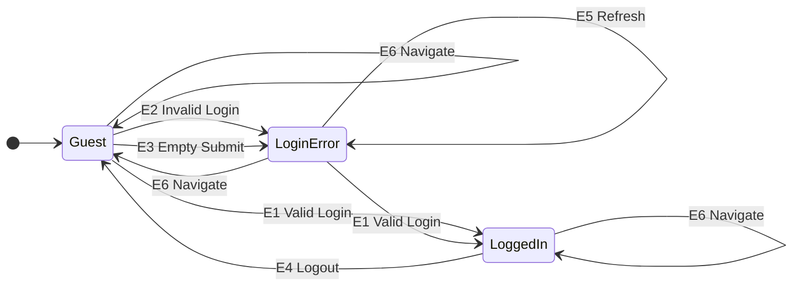
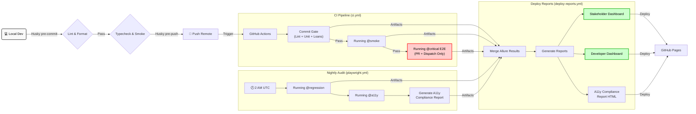

# Technical Design & Engineering Specifications

This document provides a deep-dive into the architectural patterns, ISTQB methodologies, and engineering logic implemented in the **QA-Automation-Suites** framework.

---

## Architecture & Test Pyramid
To prevent the 'Ice Cream Cone' anti-pattern, this suite is weighted toward fast, reliable unit and integration tests. This ensures maximum ROI, rapid execution, and high stability.

```text
                  / \
                 /   \
                /  E2E  \             👉 Playwright (48 Tests)
               /---------\               User Journeys & A11y
              /           \
             / Integration \          👉 Vitest + Fetch (84 Tests)
            /---------------\            API & Business Rules
           /                 \
          /       Unit        \       👉 Vitest (199 Tests)
         /---------------------\         Isolated Maths & Logic
```
*(Counts as of 2026-04-10. E2E excludes the 2 `@negative` artifact-demo tests that only run in the demo lane.)*

* **E2E (48 Tests):** High-fidelity user simulation covering smoke, critical, regression, state-transition, and accessibility scenarios. Two additional `@negative` artifact-demo tests exist in the repo but are excluded from this architectural count because they only run in the dedicated demo lane.
* **Integration + Critical (84 Tests):** API contract validation via Equivalence Partitioning (20 accounts), schema integrity (14), loan Decision Table + BVA (47), and heartbeat monitoring (3).
* **Unit (199 Tests):** Sub-millisecond validation of financial utilities, isolated business logic, and pure E2E infrastructure helpers. The 10 additional tests cover `isNetworkError` — a pure string-matching utility used by `RegisterPage` to classify navigation failures as infrastructure outages vs application defects.

---

## Loan Approval Decision Table Testing

> **ISTQB Techniques**: Decision Table Testing + 3-Value Boundary Value Analysis
> **System Under Test**: ParaBank Loan Request API
> **Risk Level**: Critical (Financial transaction logic)

### 1. Executive Summary
This document details the test design for ParaBank's loan approval functionality using **Decision Table Testing** combined with **3-Value Boundary Value Analysis (BVA)**. The loan approval process is critical to any banking system - incorrect approvals risk financial loss; incorrect denials damage customer relationships.

**Coverage achieved**: 34 test cases providing complete combinatorial coverage of business rules plus 3-Value BVA testing (-2, -1, 0, +1, +2) at every decision point.

### 2. Decision Table Oracle
The decision table below represents all logical combinations of the two conditions:

```text
┌─────────────────────────────────────────┬───────┬───────┬───────┬───────┐
│                                         │  R1   │  R2   │  R3   │  R4   │
├─────────────────────────────────────────┼───────┼───────┼───────┼───────┤
│ CONDITIONS                              │       │       │       │       │
├─────────────────────────────────────────┼───────┼───────┼───────┼───────┤
│ C1: availableFunds >= downPayment       │   T   │   T   │   F   │   F   │
│ C2: downPayment / loanAmount >= 0.1     │   T   │   F   │   T   │   F   │
├─────────────────────────────────────────┼───────┼───────┼───────┼───────┤
│ ACTIONS                                 │       │       │       │       │
├─────────────────────────────────────────┼───────┼───────┼───────┼───────┤
│ A1: Approve loan                        │   ✓   │       │       │       │
│ A2: Deny - insufficient down payment    │       │   ✓   │       │       │
│ A3: Deny - insufficient funds           │       │       │   ✓   │   ✓   │
└─────────────────────────────────────────┴───────┴───────┴───────┴───────┘
```

**Rule Explanations:**
* **R1:** Customer qualifies on all criteria.
* **R2:** Customer has funds but ratio is too low (< 10%).
* **R3:** Ratio would be OK but customer cannot cover the payment.
* **R4:** Fails both, but funds are checked first (fail-fast).

### 3. Boundary Value Analysis (3-Value BVA)

3-value BVA is more rigorous than 2-value BVA as it may detect defects overlooked by 2-value BVA. For example, if the decision `if (x <= 10) ...` is incorrectly implemented as `if (x == 10) ...`, no test data derived from the 2-value BVA (x=10, x=11) can detect the defect. However, x=9, derived from the 3-value BVA, is likely to detect it.

To ensure absolute rigor for this financial system, we **implement** 3-Value BVA test cases covering the **Invalid Partition (-2, -1)**, the **Boundary (0)**, and the **Valid Partition (+1, +2)**.

#### **Boundary 1: Funds Check**
**Boundary Definition**: `availableFunds = downPayment`

| ID                | Position | Available Funds | Down Payment | Expected    |
| ----------------- | :------: | --------------: | -----------: | ----------- |
| BVA-FUNDS-MINUS-2 |    -2    |         $199.98 |      $200.00 | ❌ Denied   |
| BVA-FUNDS-MINUS-1 |    -1    |         $199.99 |      $200.00 | ❌ Denied   |
| BVA-FUNDS-AT-0    |  **0** |         $200.00 |      $200.00 | ✅ Approved |
| BVA-FUNDS-PLUS-1  |    +1    |         $200.01 |      $200.00 | ✅ Approved |
| BVA-FUNDS-PLUS-2  |    +2    |         $200.02 |      $200.00 | ✅ Approved |

#### **Boundary 2: Down Payment Ratio**
**Boundary Definition**: `downPayment / loanAmount = 0.10 (10%)`
*(For a $1,000 loan, boundary is at $100 down payment)*

| ID                | Position | Down Payment |   Ratio | Expected    |
| ----------------- | :------: | -----------: | ------: | ----------- |
| BVA-RATIO-MINUS-2 |    -2    |       $99.98 |  9.998% | ❌ Denied   |
| BVA-RATIO-MINUS-1 |    -1    |       $99.99 |  9.999% | ❌ Denied   |
| BVA-RATIO-AT-0    |  **0** |      $100.00 | 10.000% | ✅ Approved |
| BVA-RATIO-PLUS-1  |    +1    |      $100.01 | 10.001% | ✅ Approved |
| BVA-RATIO-PLUS-2  |    +2    |      $100.02 | 10.002% | ✅ Approved |

#### **Test Coverage Visualization**
```text
           LOAN APPROVAL TEST COVERAGE
    ════════════════════════════════════════════

    Decision Table Rules       ██████      4 tests
    Funds Check BVA (-2..+2)   ████████    5 tests
    Ratio Check BVA (-2..+2)   ████████    5 tests
    Loan Amt BVA (-2..+2)      ████████    5 tests
    Down Pmt BVA (-2..+2)      ████████    5 tests
    Avail Funds BVA (-2..+2)   ████████    5 tests
    Combined Boundaries        ████████    5 tests
    ────────────────────────────────────────────
    TOTAL                                 34 tests
```

---

## State Transition Testing (Authentication)
The authentication flow is modelled as a finite state machine with three observable states. Each transition is verified by asserting the starting state, triggering the event, and confirming the resulting state via the Page Object Model.



---

## CI/CD Pipeline Orchestration
The pipeline uses **GitHub Actions** with strict quality gates. This multi-lane approach provides rapid feedback for developers while maintaining full regression confidence.



---

## Containerised Nightly Execution

The nightly regression and a11y lanes run inside the official Playwright Docker image, both locally and in CI. This eliminates the most common source of environment drift: different browser binary versions between developer machines and the build server.

### Why the Official Playwright Image

The `mcr.microsoft.com/playwright` image bundles Chromium, Firefox, and WebKit with all system-level dependencies pre-installed. Key advantages over the alternative (Node base image + `npx playwright install --with-deps`):

| Concern | `playwright install` on bare Node | Playwright Docker image |
|---|---|---|
| Browser download per CI run | ~300–600 MB every cache miss | Zero — browsers are baked in |
| Environment parity | Depends on OS, distro, and apt version | Consistent image locally and in CI (requires Dockerfile tag = npm version) |
| Setup complexity in CI | Node + npm ci + browser install (3 steps) | Docker build (cached) + docker run |
| First-run speed | Fast (if apt cache hits) | Slower initial pull (~2.3 GB), fast thereafter |

The image is cached after the first pull. Subsequent runs only rebuild the npm dependency layer when `package-lock.json` changes.

### Architecture

```text
┌─────────────────────────────────────────────────────────────┐
│  Dockerfile (mcr.microsoft.com/playwright:v1.58.0-noble)    │
│                                                             │
│  + Node 24 (NodeSource apt layer)                           │
│  + npm ci (dependency layer — cached on package-lock.json)  │
│  + Source copy                                              │
│  + Output dirs: reports/  allure-results/{e2e,unit,         │
│                           integration}/                     │
│                                                             │
│  CMD: npx tsx scripts/run-nightly.ts                        │
└──────────────────────────┬──────────────────────────────────┘
                           │  docker run (bind mounts)
           ┌───────────────┼───────────────┬───────────────────┐
           │               │               │                   │
           ▼               ▼               ▼                   ▼
   ./reports/      ./allure-results/ ./allure-results/ ./allure-results/
   e2e-results        e2e/              unit/           integration/
   e2e-regression     Allure E2E        Allure unit     Allure API
   a11y-results       results           results         results
   unit-summary
   loan-results
```

Output directories are bind-mounted from the host so report artefacts land on the local filesystem without requiring `docker cp`. The bind-mount paths match the CI artefact upload paths.

### Nightly Sequence (`scripts/run-nightly.ts`)

`run-nightly.ts` is the single source of truth for the nightly audit sequence, used by both the Docker CMD and the CI `nightly-audit` job. The CI job runs this same script inside the same image, so the execution steps are consistent:

```text
1. Unit tests (vitest)               — soft-fail: continues regardless of outcome
2. API integration tests (vitest)    — soft-fail: continues regardless of outcome
3. Loan decision table tests         — soft-fail: continues regardless of outcome
4. @critical E2E (chromium)          — produces e2e-critical-results.json;
   always written in a finally block so the dashboard never sees a missing file
5. @regression cross-browser matrix (chromium + firefox + webkit)
6. Preserve e2e-results.json → e2e-regression-results.json
   (prevents a11y run from overwriting the regression JSON)
7. @a11y audit (chromium)            — always runs, even after regression failure
8. Generate a11y compliance markdown report
```

Failure behaviour:
- Steps 1–3 (vitest): failure is recorded but never aborts later phases. All three suites run regardless of each other.
- Step 4 (critical E2E): failure sets `criticalFailed`. The `e2e-critical-results.json` file is always written in a `finally` block, so the stakeholder dashboard is never left with a partial dataset regardless of test outcome.
- Critical login-surface failures stay red. When ParaBank responds but the login form does not render, the failure is classified as `UPSTREAM_LOGIN_SURFACE_UNAVAILABLE` and Playwright attaches `login-surface-diagnostics` JSON with URL, title, `/index.htm` status, selector counts, visible error text, and a page text snippet.
- Steps 5 and 7 (E2E): each has its own flag (`regressionFailed`, `a11yFailed`). A11y always runs — nightly is an audit lane, not a fail-fast gate. Running a11y after a regression failure gives the full picture and avoids carrying stale a11y data into the stakeholder dashboard. A warning is printed when a11y runs after a regression failure so context is visible in CI output.
- The preserve steps run in `finally` blocks so partial results are always captured.

### Local Commands

```bash
# Build the image (once, or after Dockerfile / dependency changes)
npm run docker:build

# Run the full nightly sequence and write outputs to ./reports and ./allure-results/e2e
npm run docker:run

# Build, verify environment, inspect outputs, write dockerAudit.md
npm run docker:audit

# Run nightly sequence without Docker (requires local browser install)
npm run test:nightly
```

### CI Integration

The `nightly-audit` job in `playwright.yml` builds the image with Docker Buildx and GitHub Actions layer caching, then runs the container with bind mounts for the output directories. The cache key covers `Dockerfile` and `package-lock.json`, so the image is only fully rebuilt when browsers or dependencies change.

```text
cache key: docker-nightly-{hash(Dockerfile + package-lock.json)}
```

Artefact upload paths (`reports/`, `allure-results/e2e/`, `allure-results/unit/`, `allure-results/integration/`) are bind-mounted so outputs land at the expected host paths and are picked up by the existing CI artefact upload steps.

---

## Financial Precision Engineering
Standard JavaScript floating-point arithmetic is unsafe for banking applications due to the way binary fractions are represented.

$$0.1 + 0.2 = 0.30000000000000004$$

Our framework includes a dedicated helper library validated by **62 specific tests** to ensure absolute integrity:
* **Banker's Rounding:** Implemented to reduce statistical bias in interest calculations by rounding to the nearest even number.
* **Integer Math (Cents):** All internal arithmetic is performed in integer space (cents) to avoid precision loss.
* **Zero-Tolerance Validation:** Strict guards against `NaN`, `Infinity`, and invalid currency formats.

---

## Execution & Workflow

### **Environment Setup**
```bash
# Ensure Node.js v24.11.1+ is installed (see .nvmrc)
# Install dependencies and browsers
npm install && npx playwright install
```

### **Local Commit/Push Gate Setup (Husky)**
Run this once after cloning so local commit and push checks follow the repo gates:

```bash
git config core.hooksPath .husky
npm ci
npm run prepare
npx playwright install chromium
```

### **Test Execution Commands**
```bash
# Quality Gates
npm run lint            # Code style enforcement
npm run typecheck       # TypeScript validation

# Running by Business Risk (Lanes)
npm run test:smoke      # Fast connectivity check (API + E2E)
npm run test:critical   # Critical API, loan report, and E2E checks
npm run test:regression # Chromium regression lane
npm run test:regression:matrix # Full cross-browser parity (Nightly)
npm run test:a11y       # Accessibility Audit (Nightly)
npm run test:heartbeat  # API Health Monitor
npm run test:audit      # Run Regression + A11y (Full Audit)
npm run test:loans      # Run Loan Decision Table scenarios (47 tests)
npm run test:e2e:known-defects # Known-defect tracking lane

# Running by Architectural Layer
npm run test:unit       # 199 tests (Logic, Math & E2E infrastructure helpers)
npm run test:api        # Contract and integration API checks; loan decision table is separate
npm run test:e2e        # Chromium gate (excludes @negative/@known-defect)
npm run test:e2e:matrix # Cross-browser matrix when all browsers are installed

# Verify critical E2E outcome policy
npm run verify:e2e:critical
```

### **Reporting**
```bash
# Generate and view Allure Dashboard locally
npm run report:generate
npm run report:open

# Generate Stakeholder Dashboard
npm run report:stakeholder
```

---

## Dual Dashboard Architecture

The reporting system provides two audience-specific views. Each test lane feeds JSON data into both dashboards via CI artefacts, with zero overlap between lanes.

```text
┌─────────────────────────────────────────────────────────────────┐
│                     TEST EXECUTION                               │
│  ┌──────────┐  ┌──────────┐  ┌──────────┐  ┌──────────┐        │
│  │  Vitest  │  │  Vitest  │  │Playwright│  │Playwright│        │
│  │   Unit   │  │   Loans  │  │   E2E    │  │   A11y   │        │
│  └────┬─────┘  └────┬─────┘  └────┬─────┘  └────┬─────┘        │
│       │             │             │             │               │
│       ▼             ▼             ▼             ▼               │
│  unit-summary  loan-results  e2e-critical   a11y-results       │
│    .json         .json       -results.json    .json            │
│                              e2e-regression                    │
│                              -results.json                     │
│       │             │             │             │               │
│       └──────┬──────┴──────┬──────┴──────┬──────┘               │
│              │             │             │                      │
│              ▼             ▼             ▼                      │
│      ┌───────────────────────────────────────────┐              │
│      │        CI ARTEFACTS (per workflow)         │              │
│      │   unit-reports / reports-critical /        │              │
│      │   reports-nightly / allure-results-*       │              │
│      └───────────────────┬───────────────────────┘              │
└──────────────────────────┼──────────────────────────────────────┘
                           │
           ┌───────────────┴───────────────┐
           │                               │
           ▼                               ▼
┌─────────────────────┐        ┌─────────────────────┐
│  ALLURE GENERATOR   │        │ STAKEHOLDER SCRIPT  │
│   (allure-cli)      │        │ (TypeScript)        │
│                     │        │                     │
│ + categories.json   │        │ Reads all 4 JSON    │
│ + environment.props │        │ files, merges E2E   │
└──────────┬──────────┘        └──────────┬──────────┘
           │                               │
           ▼                               ▼
┌─────────────────────┐        ┌─────────────────────┐
│ DEVELOPER DASHBOARD │        │STAKEHOLDER DASHBOARD│
│  /allure/           │        │  /stakeholder/      │
│                     │        │                     │
│ • Full test details │        │ • Confidence score  │
│ • History & trends  │        │ • Risk level badge  │
│ • Video/screenshots │        │ • Known defects     │
│ • Failure categories│        │ • Lane summaries    │
│ • Environment info  │        │ • WCAG compliance   │
└─────────────────────┘        └─────────────────────┘
```

### Stakeholder Dashboard Lanes

The stakeholder dashboard presents four non-overlapping quality lanes:

| Lane | Source Data | What It Shows |
|------|-----------|---------------|
| **Code Quality** | `unit-summary.json` (199 unit tests) | Pass rate for isolated logic, financial maths, and pure E2E infrastructure helpers |
| **Financial Accuracy** | `loan-results.json` (47 loan tests) | Decision table + BVA coverage of loan approval rules (34 core scenarios, 1 coverage summary, 6 critical-path reruns, 6 negative cases) |
| **User Journey Coverage** | `e2e-critical-results.json` + `e2e-regression-results.json` | Known defects (amber, tagged `@known-defect`), unexpected failures (red), infra skips (grey — host unreachable), browser skips (grey — intentional per-browser exclusions). Current nightly inputs are 41 chromium `@critical` tests plus 6 logical regression tests across the cross-browser matrix (18 scheduled browser executions, 13 currently executed because 5 WebKit cases are intentionally skipped) |
| **WCAG Compliance** | `a11y-results.json` | Violation count, AA/A/Non-Compliant badge, and link to the full [compliance report](https://therainmaker1001.github.io/QA-Automation-Suites/a11y-compliance-report.html) |

E2E metrics distinguish between outcomes using Playwright's `test.status`, `results[0].status`, tags, and annotations:
- **Known defect**: `@known-defect` tagged/annotated tests that fail (tracked, not alarming)
- **Unexpected failure**: Failing tests without a known-defect marker (requires investigation)
- **Login surface unavailable**: Critical login checks fail with `UPSTREAM_LOGIN_SURFACE_UNAVAILABLE` when the server/API is reachable but the login form is absent. This is a user-visible third-party UI/auth availability failure, not a soft latency warning.
- **Skipped**: Conditionally skipped tests — includes two infrastructure-skip categories:
  - `'unreachable'` — the host could not be reached at all (DNS/connection failure); all browsers skip. This is an infrastructure outage, not an application defect.
  - `'not-found'` on Firefox — the page rendered but the form was absent; a known Firefox CI render flake. Skipped on Firefox only.
  - `'not-found'` on Chromium — fires as a hard failure with an explicit diagnostic message identifying `/register.htm`; this is a real application defect signal and must be investigated.

Critical lane gating uses a verifier step to keep known defects non-blocking while still failing the lane for unexpected defects.

### Dashboard Features Comparison

| Feature | Developer Dashboard (Allure) | Stakeholder Dashboard |
|---------|--------------------|-----------------------|
| Audience | QA Staff, Developers | PMs, Leadership |
| Detail Level | Full test execution data | Aggregated metrics |
| History | 90-day trend analysis | Current run summary |
| Failures | Stack traces, screenshots, video | Known defects vs unexpected breakdown |
| Categories | Known Defects, Unexpected, Infrastructure | N/A (aggregated into lane status) |
| WCAG | Individual violations listed | Compliance badge (AA/A/NC) |
| Risk | Per-test severity labels | Overall confidence score + risk level |
| Data Source | Allure result XML/JSON | Report JSON artefacts (5 files) |

### Data Freshness and Completeness Controls

- Each stakeholder lane card displays the source `lastRun` timestamp, so stale data is visible.
- If required inputs are missing, the stakeholder page shows a partial-data warning banner listing missing files.
- Deploy is blocked on `main` when required stakeholder inputs are incomplete, preventing publication of partial snapshots.

### Report Generation Commands

```bash
# Generate Allure report (requires Java)
npm run report:generate

# Generate Stakeholder dashboard (no Java required)
npm run report:stakeholder

# Generate A11y compliance report from existing results
npx tsx scripts/generate-a11y-compliance-report.ts

# Open Allure report in browser
npm run report:open

# Serve Allure from results (live reload)
npm run report:serve
```
